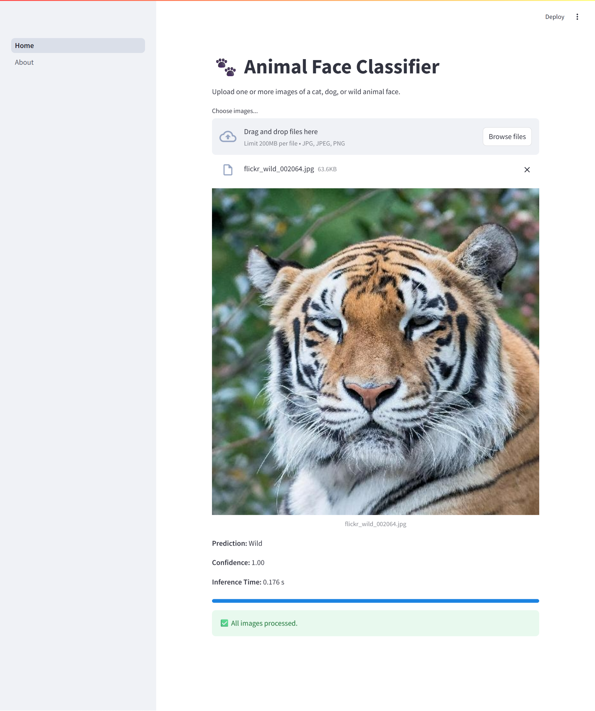
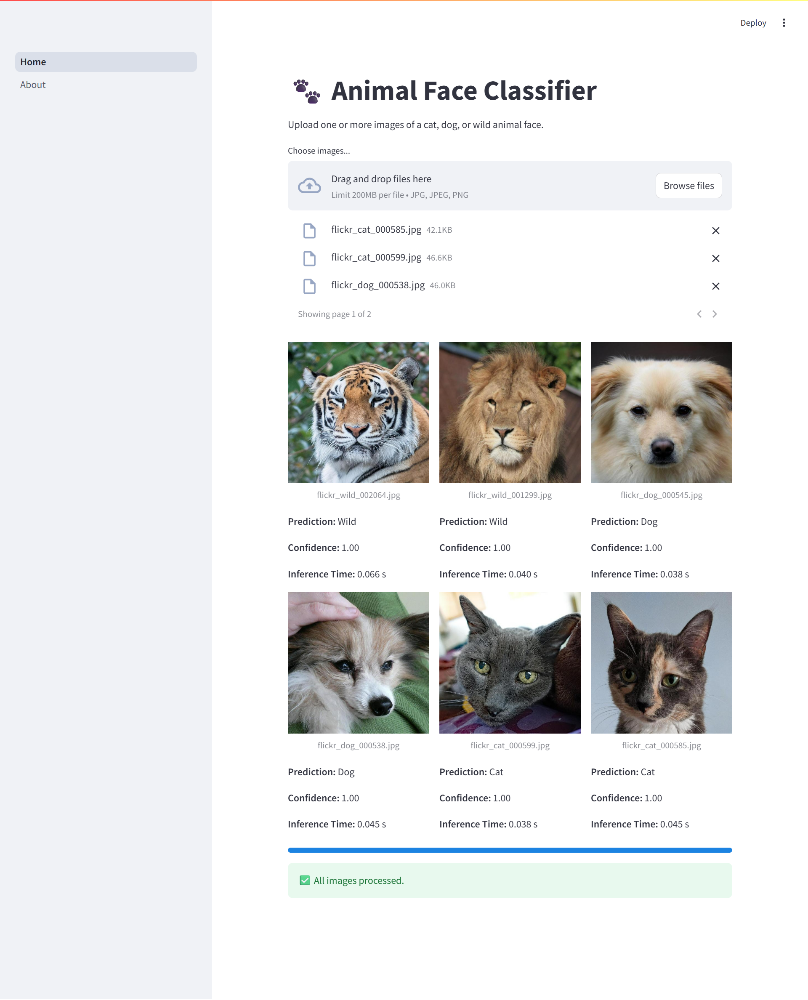

# Cat, Dog & Wildlife Classifier 🐱🐶🦁

This project is a computer vision experiment to classify images into three categories: **Cat**, **Dog**, or **Wildlife**. It consists of two major parts:

- 📓 A **Jupyter notebook** for training and evaluating different models: Custom CNN, ResNet50, and EfficientNetB0.
- 🌐 A **Streamlit web app** that performs inference on uploaded images using the best-performing model.

---

## 🧠 Models Used

We explored three different models to compare performance and accuracy:

### 1. Custom CNN

A basic convolutional neural network built from scratch using PyTorch.  
Architecture:

- 2 convolutional layers with ReLU and max-pooling
- Fully connected layers at the end

🔸 Final validation accuracy: **~95.4%**

---

### 2. ResNet50 (Transfer Learning)

A powerful residual network pretrained on ImageNet and fine-tuned on our dataset.  
We replaced the final fully connected layer to fit our 3-class output.

🔸 This model **uses transfer learning** with fine-tuning  
🔸 Final validation accuracy: **~99.4%**

---

### 3. EfficientNetB0 (Transfer Learning)

EfficientNet is a state-of-the-art lightweight model known for its excellent performance.  
We modified the final classifier layer to output 3 classes.

🔸 This model **uses transfer learning** and performed the best  
🔸 Final validation accuracy: **~99.8%**

---

## 🗂️ Dataset

The dataset used in this research comes from Kaggle, called Animal Faces-HQ (AFHQ), consisting of 16,130 high-quality images. The data is divided into 14,630 images for training and 1,500 images for validation. The dataset consists of labeled images from three classes:

- 🐱 Cats
- 🐶 Dogs
- 🐯 Wildlife (e.g., lions, tigers, foxes)

All images were resized to `224x224`.

Data augmentation techniques like random rotation, flipping, and normalization were applied during training to improve generalization.

---

## 🌟 Web App Features

The web app is built using **Streamlit** and provides the following features:

- 📤 Upload one or more images
- 🧠 Predict whether each image is a Cat, Dog, or Wildlife using EfficientNetB0
- 🧾 Display **confidence score** for each prediction
- ⏱ Show **inference time**
- 🖼️ Display images and results in a **dynamic grid layout**
- 📄 A separate page explaining the project and model in detail

---

## 🖼️ Screenshots

### 🔍 Home Page — Upload & Predict

---

### 📊 Results — Dynamic Grid with Predictions

---

### ℹ️ About Page

